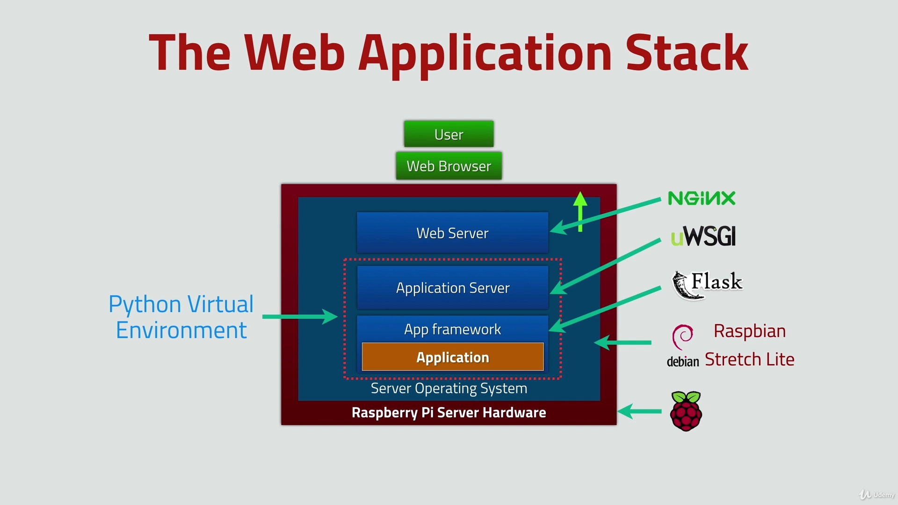

# lab_app
Aplikacja pozyskująca informacje pogodowe z czujnika DHT11 i przedstawiająca je na wykresie - aplikacja webowa

## Schemat układu:


## Stos aplikacyjny :

1.Framework aplikacji - wykorzystano **Flask** - mikro framework aplikacji webowych napisany w języku Python

2.Serwer aplikacyjny - wykorzystano **uWSGI** - serwer aplikacyjny

3.Serwer webowy (www) - wykorzystano **nginx** - serwer WWW oraz serwer proxy dla HTTP i IMAP/POP3

Dodatkowo stworzono **wirtualne środowisko Python**

Rysunek poglądowy stosu aplikacyjnego:



Baza danych: **SQLite3**

Style i frontend : **jQuery, HTML, CSS, Skeleton**

Automatyzacja procesu : **CRON** (crontab -e)

Wykresy i widgety: **Google Charts, Datetime widgets**

Dodatkowe aplikacje: **Plotly** 

## Wymagane instalacje : 

Python3: 
```
sudo apt-get install python3-pip
```
rpi.gpio: 
```
pip3 install rpi.gpio
```

Instalacja GIT i biblioteki DHT do obsługi czujnika:

GIT: 
```
sudo apt-get install git-core
```
DHT klonowanie repozytorium: 
```
git clone https://github.com/adafruit/Adafruit_Python_DHT.git
```
następnie wchodzimy do utworzonego przez klonowanie projektu 
```
cd Adafruit_Python_DHT
```
i dokonujemy instalacji pythona wewnątrz 
```
sudo python3 setup.py install
```
### Wirtualne środowisko Python

Wirtualne środowisko Pythona pozwala nam na brak konfliktów pomiędzy zainstalowanymi modułami i pakietami.

Poglądowy rysunek ukazujący różnicę pomiędzy wirtualnym środowiskiem Pythona a jego brakiem:


