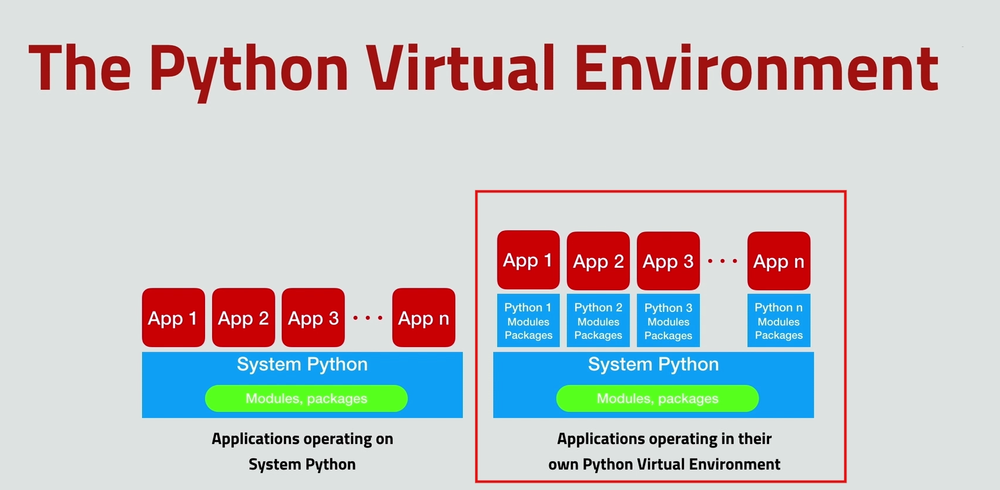

# lab_app
Aplikacja pozyskująca informacje pogodowe z czujnika DHT11 i przedstawiająca je na wykresie - aplikacja webowa

Do stworzenia aplikacji w celu poszerzenia wiedzy z zajęć na dane tematy, starałam sie wybierać nowe usługi realizujące tematy omawiane na zajęciach takie jak aplikacja webowa, baza danych, Python, crontab. Projekt ukazuje jak wiele ciekawych usług można stworzyć na niewielkim dostępnym sprzęcie jakim jest DHT11. Korzystając jedynie z tego czujnika oraz wielu usług dostepnych dla raspberry PI, powstała kompletna fukcjonalna aplikacja pozwalająca monitorować naszą życiową przestrzeń poprzez stronę internetową.

## Schemat układu:


## Stos aplikacyjny :

1.Framework aplikacji - wykorzystano **Flask** - mikro framework aplikacji webowych napisany w języku Python

2.Serwer aplikacyjny - wykorzystano **uWSGI** - serwer aplikacyjny

3.Serwer webowy (www) - wykorzystano **nginx** - serwer WWW oraz serwer proxy dla HTTP i IMAP/POP3

Dodatkowo stworzono **wirtualne środowisko Python**

Rysunek poglądowy stosu aplikacyjnego:


Baza danych: **SQLite3**

Style i frontend : **jQuery, HTML, CSS, Skeleton**

Automatyzacja procesu : **CRON** (crontab -e)

Wykresy i widgety: **Google Charts, Datetime widgets**

Dodatkowe aplikacje: **Plotly** 

## Wymagane instalacje : 

Python3: 
```
sudo apt-get install python3-pip
```
GIT: 
```
sudo apt-get install git-core
```
### Wirtualne środowisko Python

Wirtualne środowisko Pythona pozwala nam na brak konfliktów pomiędzy zainstalowanymi modułami i pakietami.

Poglądowy rysunek ukazujący różnicę pomiędzy wirtualnym środowiskiem Pythona a jego brakiem:



#### Instalacja

build-essential:
```
sudo apt-get install build-essential
```
```
sudo apt-get install libncurses5-dev libncursesw5-dev libreadline6-dev libffi-dev 
```
```
sudo apt-get install libbz2-dev libexpat1-dev liblzma-dev zlib1g-dev libsqlite3-dev libgdbm-dev tk8.5-dev libssl-dev openssl
```
```
sudo apt-get install libbz2-dev libexpat1-dev liblzma-dev zlib1g-dev libsqlite3-dev libgdbm-dev tk8.5-dev libssl-dev openssl
```
```
sudo apt-get install libpulse-dev
```
python development:
```
sudo apt-get install libboost-python-dev
```
```
sudo apt-get install python-dev
```
Instalacja edytora tekstu vim:
```
sudo apt-get install vim
```

Stworzenie folderu projektowego pod wirtualne środowisko w katalogu var/:
```
mkdir /var/www
mkdir /var/www/lab_app/
cd /var/www/lab_app/
```
Instalacja wirtualnego środowiska w folderze lab_app (ściezka do pythona -m venv .):
```
/usr/bin/python-3.7 -m venv .
```
Nastepnie logujemy sie na roota komendą 
```
sudo su
```
**Ważna komenda do aktywacji środowiska:**
```
. bin/activate
```
Po tej komendzie na początku terminala powinna pojawić się nazwa wirutalnego środowiska (lab_app) - wszystkie instalacje pakietów będą instalowane z tego wirtualnego środowiska

Dezaktywacja środowiska wirtualnego nastepuje przez komendę
```
deactivate
```

### Instalacja serwera www (nginx) oraz frameworka aplikacji (Flask)
Wejść w wirtualne środowisko przechodząc do folderu lab_app i wprowadzając komendę
```
. bin/activate
```
Komenda instalacyjna serwera:
```
apt-get install nginx
```
Usunięcie obecnej konfiguracji nginx i ustawienie nowej konfiguracji z symbolic linkiem (treść pliku **lab_app_nginx.conf** znajduje się w głównym folderze aplikacji - lab_app)
```
rm /etc/nginx/sites-enabled/default
```
Będąc na środowkisku wirtualnym lab_app w folderze lab_app tworzymi nowy plik konfiguracyjny poleceniem vim
```
vim lab_app_nginx.conf
```
Symbolic link tworzenie:
```
ln -s /var/www/lab_app/lab_app_nginx.conf /etc/nginx/conf.d/
```
Po zmianie wymagany restart usługi nginx:
```
/etc/init.d/nginx restart
```

Komenda instalacyjna frameworka Flask:
```
pip install flask
```
### Instalacja serwera aplikacyjnego (uWSGI) 
Wejść w wirtualne środowisko przechodząc do folderu lab_app i wprowadzając komendę
```
. bin/activate
```
Komenda instalacyjna serwera:
```
pip install uwsgi
```
Będąć w folderze lab_app tworzymy plik ini do serwera komendą: 
```
vim lab_app_uwsgi.ini
```
(treść pliku **lab_app_uwsgi.ini** znajduje się w głównym folderze aplikacji - lab_app)
### Automatyczne startowanie aplikacji webowej (systemd)
Tworzenie pliku emperor.uwsgi.service :
```
vim /etc/systemd/system/emperor.uwsgi.service
```
zawartość pliku: 
```
[Unit]
Description=uWSGI Emperor
After=syslog.target

[Service]
ExecStart=/var/www/lab_app/bin/uwsgi --ini /var/www/lab_app/lab_app_uwsgi.ini
# Requires systemd version 211 or newer
RuntimeDirectory=uwsgi
Restart=always
KillSignal=SIGQUIT
Type=notify
StandardError=syslog
NotifyAccess=all

[Install]
WantedBy=multi-user.target
```
Uruchomienie usługi:
```
systemctl start emperor.uwsgi.service
```
Sprawdzenie statusu usługi:
```
systemctl status emperor.uwsgi.service
```
Włączenie usługi:
```
systemctl enable emperor.uwsgi.service
```
**Restart usługi** - ważne po każdej zmianie głównego skryptu lab_app.py należy zresetować usługę:
```
systemctl restart emperor.uwsgi.service
```
Po takich operacjach nasza aplikacja będzie się odpalać zawsze, nawet po reboocie

### Instalacja i tworzenie bazy danych (SQLite3)
Przechodzimy do folderu lab_app projektu a nastepnie instalacja komendą po sudo su:
```
apt-get install sqlite3
```
Tworzymy bazę danych dla projektu:
```
sqlite3 lab_app.db
```
Tworzenie tablicy przechowującej temperatury:
```
sqlite> begin;
sqlite> create table temperatures (rDatetime datetime, sensorID text, temp numeric);
sqlite> commit;
```
Tworzenie tablicy przechowującej wilgotność:
```
sqlite> begin;
sqlite> create table humidities (rDatetime datetime, sensorID text, hum numeric);
sqlite> commit;
```
Podgląd stworzonych tabel:
```
sqlite> .tables
```
Wyjście z sqlite:
```
sqlite> .exit
```
### Instalacja GIT i biblioteki DHT do obsługi czujnika:
Będąc standardowo w folderze lab app instalujemy rpi.gpio:
```
pip install rpi.gpio
```

DHT klonowanie repozytorium: 
```
git clone https://github.com/adafruit/Adafruit_Python_DHT.git
```
następnie wchodzimy do utworzonego przez klonowanie projektu 
```
cd Adafruit_Python_DHT
```
i dokonujemy instalacji pythona wewnątrz 
```
sudo python3 setup.py install
```
### Tworzenie pliku zapisującego odczytane z czujnika dane do bazy danych i ustawienie crona na cykliczne pozyskiwanie danych:
Plik zapisujący dane do bazy znajduje się w folderze głownym aplikacji o nazwie **env_log.py**

Wejście do crona
```
crontab -e
```
Dodajemy wpis do crona o treści:
```
*/5 * * * * /var/www/lab_app/bin/python /var/www/lab_app/env_log.py >/dev/null 2>&1
```
Plik będzie sie wykonywał co 5 minut
### Plotly i chart studio:
Instalacja Plotly i chart studio:
```
pip install plotly
pip install chart_studio
pip install plotly --upgrade
```
Nastepnie tworzymy konto na chart studio i pozyskujemy potrzebne credentials z api_key (username to nasza nazwa uzytkownika a api_key to klucz dostepny na stronie - zakładka API Settings)
```
python 
import chart_studio
chart_studio.tools.set_credentials_file(username='ewela123456', api_key='lr1c37zw')
```

## Główne pliki programu:
**lab_app.py** - główny skrypt aplikacji zajmujący się routingiem, odczytywaniem danych z bazy i ładowaniem widoków aplikacji, przygotowuje również diagram w Plotly
**env_log.py** - skrypt odczytujący wartości z czujnika i zapisujący je do bazy danych. Używany w cronie w celu pozyskiwania co 5 minut nowych danych
Widoki w folderze templates:
**lab_env_db.html** - widok aplikacji przedstawiający archiwalne daty z czujników w tabelkach, wykresy z tych danych oraz filtry umożliwiające wyświetlanie danych z zakresu podanego przez użytkownika i generowanie diagramu Plotly
**lab_temp.html** - widok przedstawiający obecną temperaturę i wilgotność, odświeżający się automatycznie co 10 sekund
**no_sensor.html** - prosty widok informujący użytkownika o braku sensora
Baza danych:
**lab_app.db** - baza danych aplikacji z dwoma tablicami jedna przechowująca temperatury, druga wilgotność
